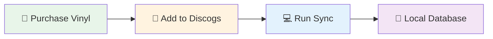
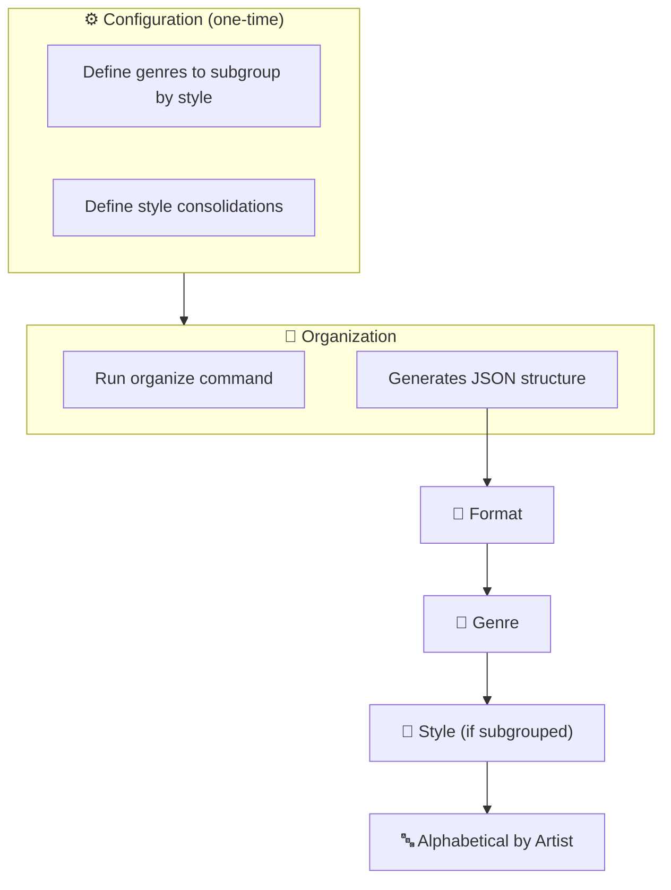
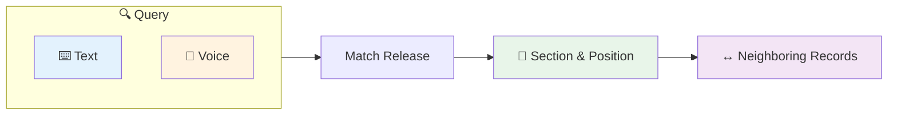
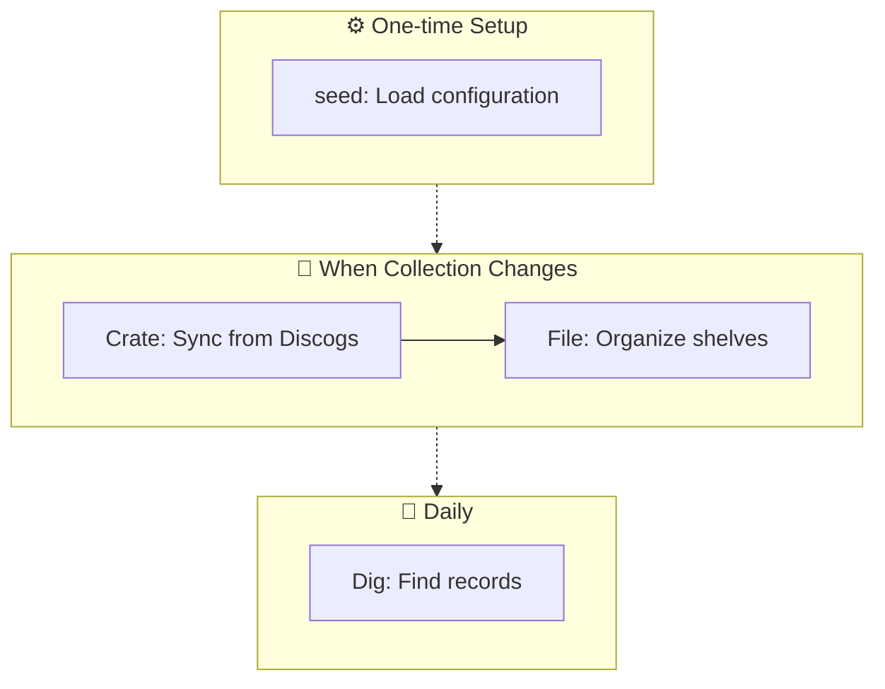

# Discollection User Guide

Your companion for managing a physical vinyl collection.

The workflow follows three phases: **Crate → File → Dig**

```
┌─────────┐      ┌─────────┐      ┌─────────┐
│  Crate  │ ───▶ │  File   │ ───▶ │   Dig   │
│         │      │         │      │         │
│  Sync   │      │Organize │      │ Locate  │
└─────────┘      └─────────┘      └─────────┘
   when new       once after        daily
   records        syncing           use
```

---

## 1. Crate — Sync Your Collection

Pull your Discogs collection into your local database.



### Steps

| Step | Action |
|:----:|--------|
| 1 | **Add to Discogs** — Log into your Discogs account and add releases to your collection |
| 2 | **Sync locally** — Run the sync command to pull your updated collection |

```bash
discollection sync
```

> 💡 **Batch your additions:** Add as many records as you want to Discogs, then sync once. No need to sync after each individual addition.

> **Result:** Your records are now in your local database, ready for filing.

---

## 2. File — Organize Your Shelves

Structure your collection so every record has its place.



### Structure

Your collection is organized hierarchically:

```
Format (e.g., LP, 7", 12")
  └── Genre (e.g., Rock, Jazz, Electronic)
        └── Style (optional, e.g., Hard Rock, Ambient)
              └── Releases sorted by Artist A→Z
```

### Commands

**Generate organized output:**

```bash
discollection organize ./my-collection.json
```

**With custom config file:**

```bash
discollection organize ./my-collection.json --config ./my-config.json
```

### Inspecting Your Collection

Use **discollection-web** to browse your organized collection visually:

1. Run `pnpm --filter discollection-web dev`
2. Upload your organized JSON file
3. Browse by format/genre in the side panel or use search
4. Explore the collection graph on the infinite canvas

### Quick Override

Need to recategorize a release?

**Via Web (fastest):**
1. Find the release in discollection-web
2. Click any **genre or style badge** on the release card
3. The `release-override` command is copied to your clipboard
4. Paste and run in terminal

**Via CLI:**

```bash
# Override genre
discollection release-override 12345 "Rock"

# Override style  
discollection release-override 12345 "Hard Rock"
```

> **Tip:** The tool auto-detects whether you're setting a genre or style based on official Discogs genres.

---

## 3. Dig — Find Your Records

Locate where a record belongs on your shelf, or find one that's already filed.



### Text Search

```bash
discollection locate ./my-collection.json "Kind of Blue"
```

**Output:**
```
Match: Miles Davis - Kind of Blue
Section: LP / Jazz
Position: 12/45 in LP > Jazz
Between: John Coltrane - A Love Supreme | Thelonious Monk - Brilliant Corners
```

### Voice Search

Start continuous voice mode — speak your queries naturally:

```bash
discollection locate ./my-collection.json
```

**Options:**

| Flag | Purpose | Example |
|------|---------|---------|
| `--once` | Single query, then exit | `--once` |
| `--voice` | Choose macOS voice | `--voice Daniel` |
| `--speech-rate` | Words per minute | `--speech-rate 180` |
| `--no-speak` | Text output only | `--no-speak` |

**Example with options:**

```bash
discollection locate ./my-collection.json --voice Samantha --speech-rate 200
```

> **To exit voice mode:** Say "stop listening" (or your custom `--stop-phrase`)

### Understanding the Response

```
┌─────────────────────────────────────────────────────┐
│  Match: Miles Davis - Kind of Blue                  │
│  Section: LP / Jazz                                 │
│  Position: 12/45 in LP > Jazz                       │
│  Between: A Love Supreme | Brilliant Corners        │
└─────────────────────────────────────────────────────┘
         ↑                ↑              ↑
     Your record    Where it is    Neighbors to find
```

---

## Quick Reference



| Phase | Command |
|-------|---------|
| **Crate** — Sync | `discollection sync` |
| **File** — Organize | `discollection organize <output.json>` |
| **Dig** — Locate (text) | `discollection locate <collection.json> "query"` |
| **Dig** — Locate (voice) | `discollection locate <collection.json>` |
| Override categorization | `discollection release-override <id> "value"` |

---

## Example Session

```bash
# 1. CRATE: You bought new records and added them to Discogs
discollection sync

# 2. FILE: Organize to include the new records
discollection organize ./my-collection.json

# 3. DIG: Find where to place a record on the shelf
discollection locate ./my-collection.json "Rumours"

# Output:
# Match: Fleetwood Mac - Rumours
# Section: LP / Rock
# Position: 8/32 in LP > Rock
# Between: Eagles - Hotel California | Led Zeppelin - IV
```

Place your Rumours LP between Hotel California and Led Zeppelin IV. Done! 🎶
